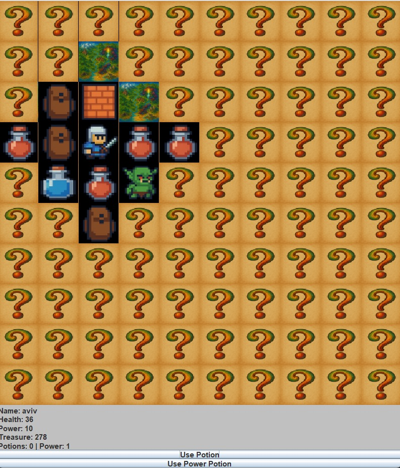

# 🎮 Dungeons & Dragons Inspired Game Engine
Java | OOP | MVC | Design Patterns | Multithreading
# 📌 Overview
This project is a turn-based Dungeons & Dragons inspired game developed in Java, built using strict MVC architecture and advanced Object-Oriented Design principles.

The system demonstrates clean architecture, modular design, concurrency management, and real-world implementation of multiple design patterns.

The game includes a grid-based interactive world, dynamic enemy behavior, combat mechanics, visibility rules, and full state persistence.
# 🏗 Architecture
The project follows a strict MVC pattern:

- Model – Game logic, world state, combat system, entities

- View – Java Swing GUI (GridLayout-based map rendering)

- Controller – Handles user interaction and event delegation

- The model remains completely independent from the GUI layer.
# ⚔ Core Features
🎮 Grid-based interactive map (Java Swing)

👁 Line-of-sight visibility system (range-based discovery)

🗡 Range-based combat mechanics

- Warrior: Range 1

- Mage/Archer: Range 2

🤖 Multithreaded enemy AI using a Thread Pool

🔄 Real-time GUI updates using Observer pattern

💾 Save & Load functionality (Memento pattern)

🧩 Dynamic enemy creation system

🎯 Clean event delegation (no direct GUI logic in model)
# 🧠 Implemented Design Patterns
- Singleton – GameMap instance management

- Factory Method – Enemy creation using Supplier map

- Builder – Dynamic player & enemy construction

- Decorator – Buffs and enhancements

- Observer – Automatic GUI updates

- Memento – Game state persistence

- Thread Pool – Concurrent enemy management
# 🔄 Concurrency & Synchronization
- Each enemy runs as a managed task inside a Thread Pool

- Shared map access is synchronized

- Thread-safe combat resolution

- Controlled GUI updates from model events
# 🛠 Technologies Used
- Java 17+

- Java Swing (GUI)

- OOP Principles

- Multithreading & Synchronization

- Design Patterns

- Event Delegation

- MVC Architecture
# ▶ How to Run
1. Clone the repository: git clone https://github.com/Aviv95/dnd-java-game.git
2. Open the project in IntelliJ IDEA (or any Java IDE)
3. Run the Main class
# 📷 Screenshots

# 🎯 Project Goals
This project was developed to demonstrate:

- Advanced Object-Oriented Programming

- Real-world design pattern implementation

- Concurrent systems design

- Clean architecture principles

- Game system modularity and extensibility
# 👨‍💻 Author
Aviv Nahum | 
Software Engineering Student | 
Passionate about Game Development & System Design
